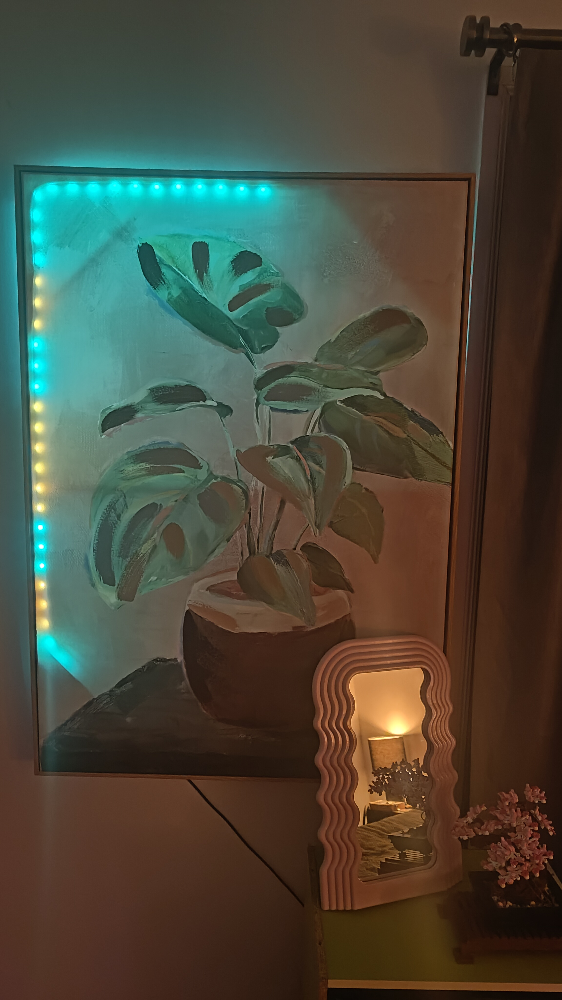
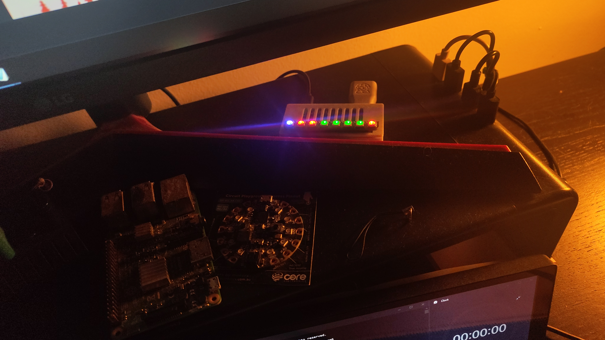

# WLED_Grocy_Indicator
Python scripts that run on a Raspberry Pi on my home network. These scripts change the WLED lights I have set up in various rooms to represent the status of chores related to each room.

## Painting Example

## Blinkt! Example for smaller desk setup

